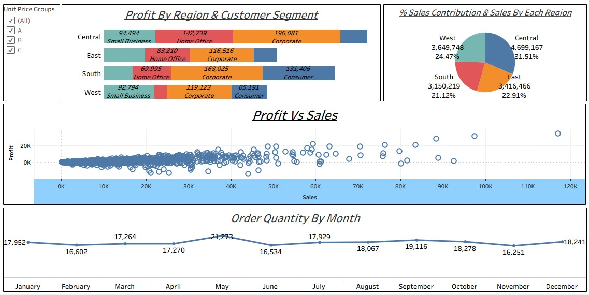

# 📊 Tableau Sales & Profit Analysis Dashboard

## 🔹 Project Overview

This project showcases an interactive **Tableau dashboard** designed to analyze sales, profit, and customer behavior across different regions and segments. The dashboard provides meaningful insights into business performance using visual analytics.

---

## 🔹 Tools & Technologies

* Tableau Desktop
* Microsoft Excel / CSV Dataset

---

## 🔹 Dashboard Features

* 📌 **Profit by Region & Customer Segment**
  Visualizes profit distribution across regions (Central, East, South, West) and segments (Consumer, Corporate, Home Office, Small Business).

* 📌 **Sales Contribution by Region**
  Pie chart showing percentage contribution of each region to total sales.

* 📌 **Profit vs Sales Analysis**
  Scatter plot to identify relationship between sales and profit and detect high/low performing transactions.

* 📌 **Order Quantity by Month**
  Line chart representing monthly trends in order quantity.

* 📌 **Interactive Filters**
  Unit Price Group filter (A, B, C) to dynamically explore data.

---

## 🔹 Key Insights

* Central region contributes the **highest sales (~31.5%)**
* West region also shows strong performance (~24.5%)
* Corporate segment generates **significant profit across regions**
* Positive correlation observed between **sales and profit**
* Order quantity peaks around mid-year and stabilizes towards year-end
---

## 🔹 Dashboard Preview

---

## 🔹 How to Use

1. Download the `.twbx` file from this repository
2. Open it using Tableau Desktop
3. Use filters to explore different segments and regions

---
## 🔹 Author

**Aniket Pawar**

---

## 🔹 Conclusion

This dashboard demonstrates the ability to transform raw data into actionable insights using Tableau, highlighting key business trends and supporting data-driven decision-making.
